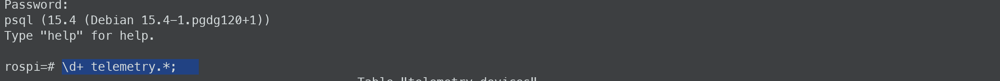
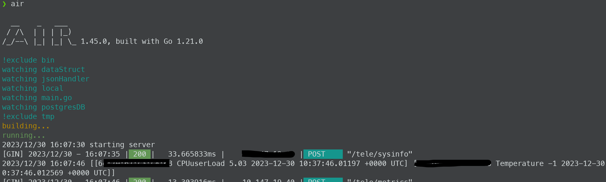
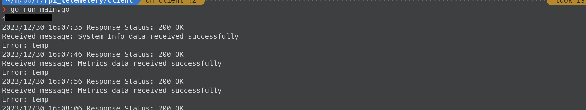

> Go program to collect system stats from IoT devices and save into postgres Database.
##### Windows not supported
- Integrated Grafana and PostgreSQL via Docker for efficient data storage and real-time monitoring.
- Ensured data integrity and concurrency using Mutex and Goroutines. 
- Leveraged `pgx` for optimized PostgreSQL connectivity. 


### SetUp

1. [Install Docker](https://docs.docker.com/get-docker/) and if you are new to docker use this [guide](https://docs.docker.com/guides/get-started/)
2. make a directry and cd into it via terminal and clone the repo into it  via following command

```
git clone https://github.com/devashishRaj/rpi_telemetry.git
```
3. create a .env file for login credentials and setting paths, [Guide](misc/envFileGuide.md) 

4. now run " docker compose up -d " (only for first time later use docker compose start)

```
docker compose up -d : to create and start container(s) as background processes   
and you get your terminal back.

docker compose down : stop and delete container(s)

docker compose start : to start existing container(s)

docker compose stop : to pause the running container(s)

```
5. open a new tab in terminal and run "docker exec -it postgres bash "   
to start an interactive shell session inside the running "postgres" container.


6. now type "psql -d POSTGRES_DB -U POSTGRES_USER -W " , replace the placeholders with what you have   
filled in .env file , now you are in that database .

7. type "\d+ telemetry.*;" to see if the schema.sql was processed during first-time postgress  
execution or not .



> if the output matchs schema file , go ahead else run "docker compose down" and start again 

> on firs run grafana container extis automatically(a bug ), run it again via desktop appllication or cli

8.(A) Viper configuraton [repo link](https://github.com/spf13/viper#getting-values-from-viper)

- **cd into server folder** 
```
makedir -p local/.config
```
- cd into config 
```
vim config.json or your favourite editor
```
- copy the block and edit values as from user to dbname as per your .env file 

```json

{
    "postgresDB": {
        "host": "localhost",
        "port": "5432",
        "user": "xyz",
        "password": "xyz",
        "dbname": "xyz" ,
        "sslmode": "disable"
    }
}

```

- save file 

- CD into client folder 
- perform same task but for this config.json copy below block and change xyz to your server IP. 

```json
{
    "systemInfo": "http://xyz:8080/tele/sysinfo",
    "systemMetrics": "http://xyz:8080/tele/metrics"
}

```

8. (B) If you want to test the program on same system
    - open a new terminal tab and run "air" in sever folder 
    - run "go run main.go" in client folder tab . 

If all goes right you will see output in both tabs similar to this.




9. Go back to postgres tab in terminal and run 

"select * from telemetry.devices;" : you will see system info 
"select * from telemetry.metrics_new order by timestamp desc ; " : you will latest entries as per [UTC](https://en.wikipedia.org/wiki/Coordinated_Universal_Time).


__to watch entries in your time-zone for example IST, you can try following sql queries__

```sql 

SELECT *, timestamp AT TIME ZONE 'UTC' + INTERVAL '5 hours 30 minutes' AS Indian_timestamp
FROM telemetry.metrics_new
ORDER BY Indian_timestamp DESC;

```

or 

```sql 
SELECT *, timestamp AT TIME ZONE 'Asia/Kolkata' AS ist_timestamp
FROM telemetry.metrics_new
ORDER BY ist_timestamp DESC;
```


Resources for Grafana :
- https://grafana.com/tutorials/
- https://grafana.com/docs/grafana/latest/datasources/postgres/

[Reference](https://semaphoreci.com/community/tutorials/building-and-testing-a-rest-api-in-go-with-gorilla-mux-and-postgresql)

__TIP__ : tip : use zerotier for multiple devices existing on different networks 

