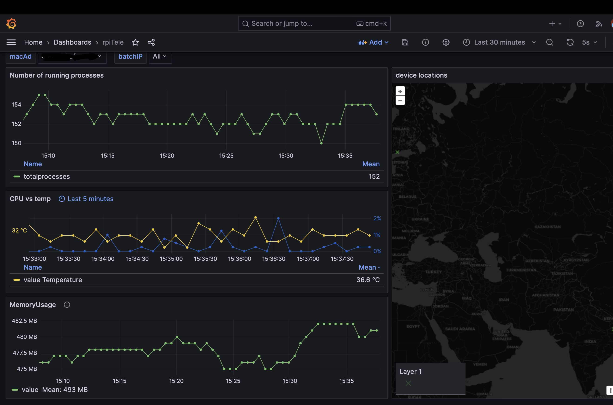

> Grafana dashboard to show system stats of various IoT devices using golang , docker and postgres.

### SetUp

#### Section 1 : Docker 

1. [Install Docker](https://docs.docker.com/get-docker/) and if you are new to dockere use this [guide](https://docs.docker.com/guides/get-started/)
2. make a directry and cd into it via terminal and clone the repo into it  via following command

```
git clone https://github.com/devashishRaj/rpi_telemetry.git
```
3. create a .env file for login credentials and setting paths, [Guide](envFileGuide.md) 

4. now run " docker compose up -d " (only for first time later use docker compose start)

```
docker compose up -d : to create and start container(s) as background processes   
and you get your terminal back.

docker compose down : stop and delete container(s)

docker compose start : to start existing container(s)

docker compose stop : to pause the running container(s)

```
5. open a new tab in terminal and run "docker exec -it postgres bash "   
to start an interactive shell session inside the running "postgres" container.


6. now type "psql -d POSTGRES_DB -U POSTGRES_USER -W " , replace the placeholders with what you have   
filled in .env file

[Reference](https://semaphoreci.com/community/tutorials/building-and-testing-a-rest-api-in-go-with-gorilla-mux-and-postgresql)

